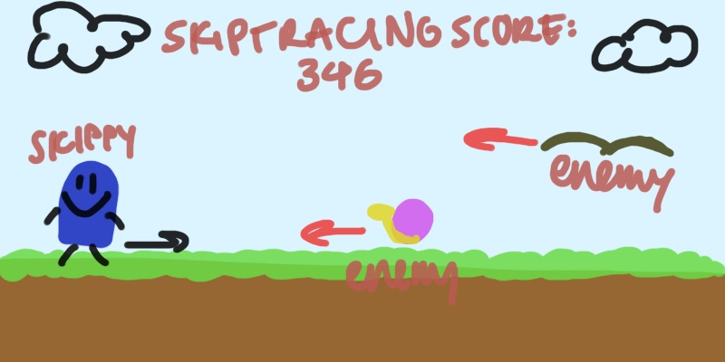

# Skiptracing

## CS110 Final Project Fall 2024 

## Team Members: 
Sofie Caballes 

## Project Description: 
Welcome to skiptracing: a 2D side-scrolling platformer. Your primary objective is to control a pixelated character, Skippy, and avoid enemies like snails and flies! Gross! The longer you live, the better your score. Can you take Skippy to his greatest heights? 

## GUI Design 

### Initial Design  
 

### Final Design 
 

## Program Design

### Features 
1. Start Menu
2. Animated characters
3. Obstacle collisions 
4. Game over screen 
5. High Score Rankings   

### Classes: 
#### Player Class 
*Attributes*: 
- `player_walk`: List of images used for players walking animation 
- `player_index`: Index to track current frame in the walking animation. 
- `player_jump`: Image used for the player's jumping animation. 
- `image`: Current image of player to be displayed. 
- `rect`: Rect object defining the player's position and size. 
- `gravity`: Value to simulate gravity's effect on the player. 

*Methods*: 
- `__init__(self)`: Initializes the player object. 
- `player_input(self)`: Handles player input for controlling the player. 
- `apply_gravity(self)`: Applies gravity to player, causing player to fall downward. 
- `animation_state(self)`: Updates the player's animation state based on whether the player is walking or jumping. 
- `update(self)`: Updates the player's state every frame, including handling input, applying gravity, and updating animation. 

#### Obstacle Class 
*Attributes*: 
- `frames`: List of images used for obstacle's animation.
- `animation_index`: Index to track the current frame in the animation. 
- `image`: Current image of the obstacle to be displayed. 
- `rect`: Rect object defining the obstacle's position and size. 

*Methods*: 
- `__init__(self, type)`: Initializes the obstacle object, loading images based on the obstacle type (fly or snail). 
- `animation_state(self)`: Updates the obstacle's animation state by cycling through frames. 
- `update(self)`: Updates the obstacle's state each frame, including moving and possibly destroying obstacle. 
- `destroy(self)`: Destroys the obstacle if it moves off-screen. 

#### High Score Class 
*Attributes*: 
- `conn`: Connection object to the SQL database. 

*Methods*: 
- `__init__(self, db_name='high_scores.db)`: Initializes the HighScore class with a connection to the database and creates the scores table.
- `create_connection(self, db_name)`: Creates a connection to the SQLite database. 
- `create_table(self)`: Creates the scores table in the SQLite database. 
- `insert_score(self, score)`: Inserts a new score into the datbase.
- `get_high_scores(self, limit=3)`: Retrieves the top high scores from the database. 

## ATP 

| Step | Description | Results | 
| --- | --- | --- | 
| 1. **Obstacles**: Verify obstacle generation and movement. | Start the game. Verify that obstacles (flies and snails) are generated at random intervals. Press space to dodge enemies. Verify that obstacles move from right to left across screen. Verify that obstacles are removed when they move off-screen.  | Obstacles are generated, move correctly, and are removed when off-screen. | 
| 2. **Player Movement**: Verify the player's jump works as expected. | Start the game. Press space to make the player jump. Verify the player jumps. Let the player fall. Verify the player falls due to gravity. | The player responds to gravity and jumps correctly when the space key is pressed. | 
| 3. **Collision Detection**: Verify collision detection between the player and obstacles. | Start the game. Allow the player to collide with an obstacle. Verify the game ends upon collision. |Collisions are detected correctly, ending the game.  | 
| 4. **Scoring**: Verify high score ranking is functional. | Start the game. Collide the player with an obstacle to view high scores. Restart. Play and beat the high score. Verify the high score displays in the game over screen rankings.| The high score is calculated and displayed correctly. Previous high scores are preserved, and slotted below the #1 high score. | 
| 5. **Game Over Screen**: Verify the game over screen display.  | Start the game. Collide with an obstacle. Verify the game over screen displays the player's final score, high score rankings, and a press space text. | The game over screen displays correctly with the final score, high score rankings, and a press space text. | 

